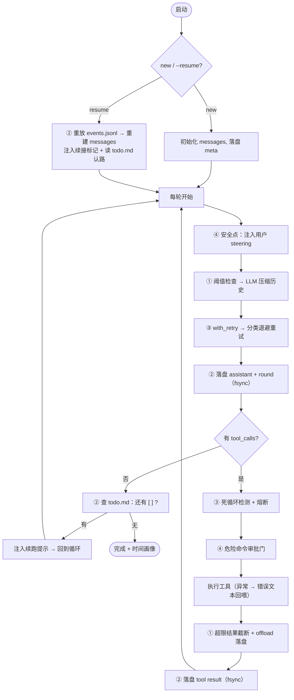

# 如何设计一个能连续执行 2 小时任务的 Coding Agent

> Kimi Product Engineer 笔试题 1。不是纯设计文档——四个机制全部实现为可开关原型，
> 用故障注入和真实开源代码库量化了每个机制的价值，且所有数据带时间画像。
> 模型：Kimi For Coding（K2.7 Code）+ DeepSeek v4-pro 跨模型对照。
> 代码仓库：[github.com/fatmmouse/kimi-coding-agent](https://github.com/fatmmouse/kimi-coding-agent) · 复现：`.venv/bin/python -m evals.scenarios --model kimi`

---

## 立场

「2 小时」不只是「更长」，它改变问题的性质。三件在短任务里偶发的事，拉到 2 小时变成统计必然：

1. **上下文必然溢出**——每轮工具调用往 messages 堆文件内容和命令日志，千轮量级会撑爆任何窗口。
2. **故障必然发生**——网络抖动、429、5xx，千次 API 调用里至少撞上一回。
3. **用户必然要介入**——没人能一句话让 agent 无偏差跑 2 小时。

同时「2 小时」还给了一个约束：**时间本身是预算**。每个可靠性机制都有成本（压缩要调一次 LLM、重试要等退避），所以不能只说「我加了机制 X」，得回答「X 花掉多少时间，值不值」。

设计原则一以贯之：

> **状态进磁盘，故障分类处置，中断有安全点，上下文按价值取舍——且每一项的时间成本可见、可控。**

四个机制对应四个模块，每个都有 `--no-xxx` 开关关掉，开/关跑同一任务就是控制变量的对照实验。实测结论：**四个机制的 harness overhead 合计不到总时间的 2%（LLM 推理占 85–96%）。它们几乎是免费的可靠性——时间成本可忽略，却决定了任务能不能跑完。**

---

## 架构：四机制如何挂在主循环上

①②③④ 不是四个孤立模块，而是挂在主循环每一轮的不同位置，形成一条完整的安全链：



---

## 机制① 上下文管理

**问题**：messages 线性增长。千轮任务必撞窗口，撞了要么报错退出，要么被 provider 静默截断——后者更危险，模型不知道自己丢了什么。

**设计：三层防线**（[context.py](../harness/context.py)）

1. **截断 + offload**：单条工具结果超 4000 字符 → 保留头尾、完整内容落盘到 `.agent/outputs/`，告诉模型「需要时 read_file 取回」。大块低价值文本不进上下文，但没真丢。
2. **历史压缩**：输入 token ≥ 窗口 75% → 调 LLM 把旧历史压成结构化摘要（当前焦点 / 已完成 / 错误与解法 / 关键文件 / TODO），保留最近 3 个完整 turn。**切割铁律**：切点只落在完整 turn 边界，绝不把 tool_call 和对应 tool_result 切散——切散直接 400。
3. **文件系统即记忆**：todo.md、产物代码在 workspace 文件里，不依赖对话记忆。压缩丢的是过程，不是结果。

**为什么 75%**：压缩不免费——要额外调一次 LLM，且有信息损失。实测数据表明这个成本比直觉中大得多：

| 指标 | K2.7 compact_on | K2.7 compact_off | DeepSeek on | DeepSeek off |
|---|---|---|---|---|
| 完成（pytest 通过数） | ✅ 16 | ✅ 33 | ✅ 60 | ✅ 46 |
| 压缩次数 | 1 | 0 | **7** | 0 |
| 总耗时 | 60.7s | 63.5s | **185.2s** | 90.7s |
| 压缩 overhead | 4.8s (8%) | — | **84.1s (45%)** | — |
| 2h 吞吐外推 | ~1896 轮 | ~1473 轮 | **~933 轮** | ~1826 轮 |

> 同一硬任务（算术求值器 + pytest 全绿），窗口缩到 5000 强制触发压缩。

K2.7 压 1 次，overhead 可忽略，开/关基本持平。DeepSeek 摘要更啰嗦 → 更快再超阈值 → 连压 7 次，**光压缩就烧掉总时间的 45%，2h 吞吐量直接腰斩**。

这个数据定义了机制①全部的设计取向：**能不压就不压、要压就晚压**——75% 高阈值、只压旧历史保留最近 3 轮、重要状态放文件系统。压缩在「不压会撞墙」时是救命的，但频繁触发就是时间灾难。且这一点是模型相关的：同一策略在不同模型上表现差异巨大——所以机制①的工程重心不是「压得好」，而是**尽量少压**。

> 参考：Kimi CLI 双条件触发 + 压缩优先级排序；Claude Code auto-compact + 工具结果 40k 截断；pi 按 turn 边界切割。

---

## 机制② 任务状态记录

**问题**：状态只活在内存里，一次崩溃（OOM、断电、kill）就抹掉 2 小时工作。长任务必须假设「进程随时会死」。

**设计：物理层 + 语义层**（[state.py](../harness/state.py)）

- **物理层 = append-only JSONL**：每个事件（user / assistant / tool_result / round / compaction）发生即 `write + flush + fsync` 落盘。这是会话的唯一权威记录，`jq` 可审计。resume 的本质是重放 JSONL 重建 messages、从断点继续——不是重跑。
- **语义层 = todo.md**：模型自维护的 `- [ ]` / `- [x]` 清单，写在 workspace 文件里，不受上下文压缩影响。resume 后模型先读它，一眼看出做到哪了。

**为什么两层都要**：物理层保证「消息不丢」，但重放出一堆消息后模型仍需要一个人类语义的进度锚点。物理层给机器 replay，语义层给模型认路。后来发现 todo.md 还有第二个用途：**完成判定的 ground truth**——模型没调工具不等于任务完成，但 todo.md 里没有 `- [ ]` 就是真完成（详见 S7）。

| 变体 | 完成 | 轮数 | 说明 |
|---|---|---|---|
| resume_on | ✅ | 12 | 第 2 轮后 `os._exit(137)` 真杀进程；resume 从第 3 轮续完，崩溃前已 fsync 9 条事件 |
| 无 resume（baseline） | ✅ | 9 | 同任务从头跑需 9 轮——崩溃后不 resume 就全部重付 |

> S3 用 `os._exit(137)` 模拟 kill -9 级进程死亡，子进程 resume 接续。

任务越长、崩得越晚，② 救回的价值越大。一个跑到第 90 轮才崩的 2 小时任务，没有② 就是 90 轮清零。

> 参考：Codex rollout JSONL（append + flush，可重放）；Claude Code JSONL + TodoWrite + resume 续接标记。

---

## 机制③ 工具调用失败恢复

**问题**：2 小时里瞬时故障是必然，但不能无脑重试——参数错了重试一万次还是错。核心是**分类**。

**设计：API 层 + 工具层 + 防呆**（[recovery.py](../harness/recovery.py)）

- **API 层**（`with_retry`）：429 / 5xx / 超时 / 连接错 → 可恢复，指数退避 + jitter（200ms × 2ⁿ，jitter ±10%，最多 5 次）。4xx 参数错 → 不可恢复直接抛，重试无意义。上下文溢出 → `ContextOverflow` 信号，主循环先紧急压缩再重试。
- **工具层**：工具抛任何异常 → 捕获转错误文本作为 tool result **回喂模型让它自纠**，不冒泡崩主循环。重试 `python nonexistent.py` 没意义，把错误给模型看让它换做法才是恢复。
- **防呆**（`LoopGuard`）：相同调用连续 3 次 → 注入死循环纠正；连续失败 5 次 → 熔断，让模型暂停重新评估。

**退避为什么要 jitter**：多个请求同时限流后按同一节奏重试会形成重试风暴再次打爆服务端，随机抖动把重试时间打散。

**API 层实测**（故障注入：首次必失败 + 后续 25% 概率失败，seed=7）：

| 变体 | 完成 | 说明 |
|---|---|---|
| retry_on | ✅ | 退避重试 6 次跑完，等待仅 1.6s |
| retry_off | ❌ | 首个注入的 502 直接退出，任务在第 0 轮就死 |

**工具层实测**：任务里埋一条必失败命令（`python nonexistent_xyz.py`），模型看到错误后自行改建 hello.py 完成任务。tool_fails=1 但 completed=True。

长程压力测试（S7）中这两层更充分地暴露：252 轮里出现 **67 次工具失败**（import 错误、断言不对等），全部被回喂自纠、0 人工干预，361 个测试 100% 通过。长任务不是「不出错」，是「错了能自己爬起来」。

> 参考：Codex 退避 200ms×2ⁿ + jitter；Kimi CLI 工具错误类型化回喂 + ChaosChatProvider 故障注入测试。

---

## 机制④ 用户中断

**问题**：没人能一句话让 agent 无偏差跑 2 小时，中途一定要改方向。中断只能靠 kill = 要么干等、要么丢进度。

**设计：安全点 + 中断即上下文**（[interrupt.py](../harness/interrupt.py)）

1. **安全点**：后台线程非阻塞监听 stdin，用户运行中敲的字进队列，只在**工具调用边界**取出注入——不打断进行中的文件写入或状态落盘。任何时刻停下，磁盘状态自洽。
2. **中断即上下文**：用户插话作为 user 消息注入对话——模型看见「我在做 X 时被要求改成 Y」，据此改向而非懵掉。
3. **两级 Ctrl-C**：一次 = 优雅停（落盘 + 打印 resume 命令）；二次 = 强退（append-only 已保证不丢）。
4. **危险命令审批门**：`rm -rf` / `git push` / `sudo` 等模式暂停等确认（非交互环境默认拒绝）。

**安全点为什么是工具边界**：这是「可被取消」和「必须原子完成」的显式分界。LLM 调用可中断；文件写入和状态落盘不可以——它们必须原子完成，否则留下半写脏状态。来自 Kimi CLI 用 `asyncio.shield` 保护 context 写入的思想。

| 变体 | 产物 greet.py | 说明 |
|---|---|---|
| 第 2 轮注入「改 Goodbye」 | 打印 **Goodbye** | 插话在安全点注入，产物从 Hello 变 Goodbye |
| 无注入（对照） | 打印 **Hello** | — |

> 同一任务（创建 greet.py 打印 Hello），唯一变量是中途那句插话。

> 参考：Kimi CLI 可中断 step + shield 保护写入；Claude Code Esc 中断注入对话；Codex 协议层 `Op::Interrupt`。

---

## 实证：S7 长程压力测试

前面四个场景各自隔离一个机制做对照。S6 先在一个 KV store 完整项目上验证了四机制协同（19 轮 / 105s / 16 pytest passed / 2 次工具失败自纠）。S7 把压力升级到真实开源代码库：给 [boltons](https://github.com/mahmoud/boltons)（29 模块、1.7 万行 Python）的纯函数模块逐个补 pytest 并跑通——天然产生几百轮调用和反复调试迭代，最接近「2 小时」尺度。

**它真的压出了一个 harness bug——这比「跑通了」本身更有价值。**

第一次跑，agent 完成 4 个模块、120 轮后提前停了。看最后一轮：模型说「接下来继续处理 mathutils」——它想继续，但那一轮只发了句过渡性的话没调工具，被主循环「没 tool_calls = 完成」的判定误杀。todo.md 上还有 8 个模块未打勾。**这是 autonomous 长任务一个隐蔽但致命的 bug：完成判定太草率。**

修复用的正是机制②已有的语义层——无 tool_calls 时先查 todo.md 是否还有 `- [ ]`，有就 nudge 续跑，连续 nudge 到上限仍不动手才真收尾（防空转）。todo.md 从此有了第二个用途：不只给 resume 认路，也是完成判定的 ground truth。

修复后 `--resume` 这个会话，从第 120 轮无缝续上，一路做完剩余 8 个模块，没有重做任何已完成模块。

| | 第一次跑 | resume 续跑 | 合计 |
|---|---|---|---|
| 轮数 | 120 | +132 | **252** |
| 墙钟 | 604s | 729s | **1333s（22 min）** |
| 模块完成 | 4 / 12 | +8 | **12 / 12** |
| pytest 通过 | 174 | +187 | **361** |
| 工具失败（全自纠） | 35 | 32 | **67** |
| 压缩次数 | 1 | 1 | 2 |
| LLM 时间占比 | 96% | 96% | **96%** |

> 产物证据：12 个测试文件 + todo.md 固化在 [evals/results/s7_artifacts/](../evals/results/s7_artifacts/)，1927 行测试代码、361 用例全绿。

**四个发现**：

1. **完成判定是 autonomous 长任务的真实陷阱**。短任务里「没调工具=完成」几乎不出错，长任务里模型的过渡性发言会触发误杀。修复的关键是对话之外的客观进度真相（todo.md）——印证了机制②语义层的设计价值，也展示了**评测 → 暴露 → 修复 → resume 验证**这个 harness 自校正闭环。
2. **失败恢复在长程是高频路径，不是边角**。252 轮 67 次工具失败，全部自纠，0 人工干预。
3. **resume 让长任务可分段可恢复**。跨进程从 120 续到 252，没重做一步。
4. **时间瓶颈始终是 LLM 推理（96%）**。harness 全部 overhead（落盘 + 防呆 + 截断 + 压缩）不到 4%。按此速率 2h 外推约 2489 轮——上下文必然溢出、状态必须落盘，再次被坐实。反过来也说明：**优化 2h 长任务的正确方向是减少不必要的轮次和调用，而不是抠 harness 的代码性能。**

---

## 评测方法论

- **可复现**：故障注入带 seed（[chaos.py](../evals/chaos.py)），同 seed 同结果。
- **控制变量**：每个机制单独开/关，其余不变，差异可归因到该机制。
- **真实不 mock**：S3 用 `os._exit(137)` 真杀进程；S7 给真实开源库补 1927 行测试。
- **时间维度**：每轮拆 LLM / 工具 / 压缩 / 重试四个桶，结束打印画像 + 2h 外推。
- **客观判据**：硬任务用 pytest 全绿而非模型自报来判定完成。

完整结果：[evals/results/](../evals/results/)（`summary_kimi.csv` / `summary_deepseek.csv`）。

---

## 边界与取舍

原型刻意没做以下事项，它们各自重要但超出「单 agent 跑 2 小时」的核心：

- **跨会话持久记忆**：MiMo Code 的 SQLite 轨迹库 + `/dream` 记忆固化解决的是「跨任务复用经验」，不是「单任务跑完」。是演进方向，但不是这道题。
- **沙箱隔离**：生产要容器 / seccomp。原型用 workspace 路径钉死 + 审批门做最小约束，没上沙箱——与四机制正交。
- **Multi-Agent 编排**：长任务可拆子代理并行，但引入协调和上下文隔离的新复杂度，对「先把单 agent 跑稳」是过早优化。
- **流式输出 / TUI**：原型用 print 足以说明机制；真实产品的交互层是另一层工作。

选择把力气花在先量化四块基石的价值上。先证明每个机制值多少、在什么条件下失效，再铺功能，比反过来更有说服力。

---

## 运行

```bash
python3 -m venv .venv && .venv/bin/pip install openai anthropic pytest
# .env 写入 KIMI_API_KEY / DEEPSEEK_API_KEY
.venv/bin/python agent.py "你的任务"                 # 默认 K2.7
.venv/bin/python -m evals.scenarios --model kimi     # 复现全部评测数据
```
