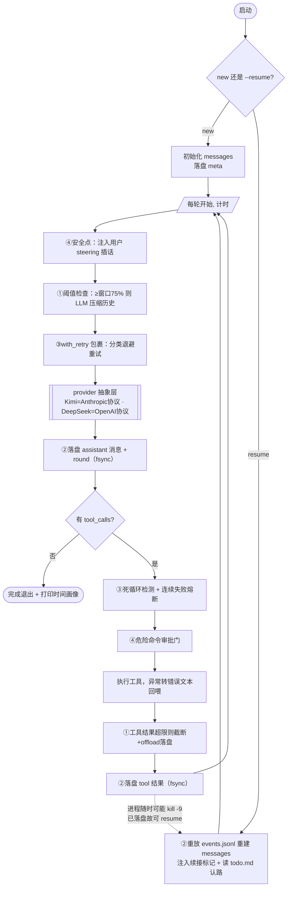

# 如何设计一个能连续执行 2 小时任务的 Coding Agent

> Kimi Product Engineer 笔试题 1。
> 这不是一篇纯设计文档——我把四个机制都实现成了可开关的原型，用故障注入 + 硬任务马拉松量化了每个机制的价值，
> 并且**记录了完整的时间画像**（题眼是「2 小时」，时间必须是第一指标）。
> 模型：**Kimi For Coding（K2.7 Code）** 为主 + DeepSeek v4-pro 做跨模型对照。
> 代码：本仓库；调研：[research.md](research.md)；下面每个数字都能用 `python -m evals.scenarios` 复现。

## 结论先行

「2 小时」这个时长本身就是题眼。它把三件在短任务里**偶发**的事变成了**必然**：

1. **上下文必然溢出**——几百轮工具调用累积的日志会撑爆任何窗口。
2. **故障必然发生**——网络抖动、429、5xx、命令挂死，在 2 小时尺度上是统计必然。
3. **用户必然要插手**——没人能写出一句话指令让 agent 无偏差自主跑 2 小时；中途一定要改方向。

而「2 小时」还多给了一个约束：**时间是预算**。可靠性机制本身有成本（压缩要额外调一次 LLM、重试要等待），
所以光说「我加了某机制」不够，得回答「它在 2 小时里花掉多少时间、值不值」。我给每个机制都量了时间画像。

所以这四个机制不是「优化项」，是长任务能不能跑完的**必需品**。我的设计原则一以贯之：

> **状态进磁盘，故障能分类，中断有安全点，上下文按价值取舍——且每一项的时间成本都可见。**

四个机制对应四个模块，每个都能用一个 `--no-xxx` 开关关掉，于是「它到底有没有用」不靠嘴说，靠对照实验：

| 机制 | 关掉它会怎样（本仓库 K2.7 实测） |
|---|---|
| ① 上下文管理 | 输入 token 单调膨胀（末轮 5120 不回落 vs 开启后压回 2498），长任务必然撞窗口 |
| ② 任务状态 | 进程一崩，崩溃前的工作全清零，只能从头再跑 |
| ③ 失败恢复 | 第一个瞬时 API 故障（注入的 502）就让整个任务在第 0 轮退出 |
| ④ 用户中断 | 要么干等到底，要么 kill 进程丢进度，无法中途把 Hello 改成 Goodbye |

### 架构：四机制如何挂在主循环上

四个机制不是四个孤立模块，而是挂在主循环每一轮的不同安全点上（①②③④ 标出介入位置）：



---

## ⏱️ 时间画像：2 小时到底能跑多少（先回答题眼）

把每一轮拆成「LLM 调用 / 工具执行 / 上下文压缩 / 重试等待」四个时间桶，跑完打印画像。各场景实测（K2.7）：

| 场景（任务） | 总耗时 / 轮数 | LLM 调用 | 工具执行 | 压缩 overhead | 重试等待 | 2h 外推 |
|---|---|---|---|---|---|---|
| **S6 马拉松（KV store 完整项目）** | 105.3s / 19 轮 | 92.9s (**88%**) | 12.5s (12%) | 0 | 0 | **~1298 轮** |
| S1 硬任务（求值器）compact_on | 60.7s / 16 轮 | 55.6s (92%) | 0.4s | **4.8s (8%)** | 0 | ~1896 轮 |
| S1 硬任务 compact_off | 63.5s / 13 轮 | 63.2s (99%) | 0.3s | 0 | 0 | ~1473 轮 |
| S4 工具失败自纠 | 49.8s / 8 轮 | 49.7s (99%) | 0.1s | 0 | 0 | ~1157 轮 |
| S2 故障重试 retry_on | 10.9s / 5 轮 | 9.3s (85%) | 0 | 0 | **1.6s (退避)** | ~3290 轮 |

三个结论，每个都直接影响产品决策：

1. **时间瓶颈是 LLM 推理本身，不是 harness**：LLM 调用稳定占 85–99%；工具执行、状态落盘、死循环检测这些 harness 开销加起来 <1%（S6 工具 12% 是因为真跑了 pytest，那是任务本身，不是 harness）。
   → **优化 2 小时长任务的正确方向是「减少不必要的轮次/调用」，而不是抠 harness 代码的性能。** 这反过来说明机制①②③④ 几乎是「免费的可靠性」——它们的时间成本可忽略，却换来「能不能跑完」。
2. **压缩是唯一可观的 harness overhead**（S1 上 4.8s / 8%）：它不免费。这正是机制① 要「尽量晚压、压得少」的成本依据——见下文 S1 的反直觉数据。
3. **2 小时外推**：硬任务约 1300–1900 轮、简单任务 3000+ 轮。一个真实 2 小时编码任务跑上千轮完全可能——**这就是为什么上下文必然溢出、状态必须落盘**，外推数字把「2 小时 = 必然」坐实了。

---

## 机制① 上下文管理

**问题**：长任务的上下文单调增长。每轮工具调用都往 messages 里塞新的命令输出、文件内容。线性堆下去，
输入 token 暴涨，最终要么撞窗口报错，要么被 provider 静默截断（更糟，模型不知道丢了什么）。

**我的设计：三层防线**（[harness/context.py](../harness/context.py)）

1. **工具结果截断 + 落盘（offload）**：单条工具结果超 4000 字符，只留头尾、中间标记，完整内容写到 `.agent/outputs/`，
   告诉模型「完整结果在这个文件，需要时 read_file」。大块低价值文本不进上下文，但没真丢——可按需取回。
2. **历史压缩（compaction）**：输入 token ≥ 窗口 × 75% 时，调一次 LLM 把旧历史压成结构化摘要
   （当前焦点 / 已完成 / 错误与解法 / 关键文件 / 设计决定 / TODO），替换被压缩段，保留最近 3 个完整 turn。
   **切割铁律**：切点只落在完整 turn 边界，绝不把 `tool_call` 和它的 `tool_result` 切散——切散直接 400。
3. **文件系统即记忆**：真正要紧的状态（todo.md、产物代码）本就在 workspace 文件里，不依赖对话记忆。压缩丢的是过程，不是结果。

**为什么是 75% 而不是撑满**：压缩本身要调一次 LLM、占输出 token、花掉时间（实测 4.8s），必须在撞墙前留余量做这件事。
双条件触发（占比 75% 或剩余空间不足）取「先到者」，是 Kimi CLI 的设计——比单一阈值更稳。

**主流对照**（详见 research.md）：Kimi CLI 双条件触发 + 压缩提示词按优先级排序（我借鉴了它的优先级）；
Claude Code auto-compact + microcompact 双层 + 工具结果 40k 截断（我的 offload 是简化版）；pi 按 turn 边界切割（我的切割铁律来自它）。

**实验数据**（S1，求值器 + pytest 硬任务，窗口缩到 5000 强制触发压缩）：

| 变体 | 完成(pytest) | 轮数 | 峰值输入 token | 末轮输入 token | 压缩次数 | 压缩耗时 |
|---|---|---|---|---|---|---|
| compact_on  | ✅ 16 passed | 16 | 3750 | **2498** | 1 | 4.8s |
| compact_off | ✅ 33 passed | 13 | 5120 | **5120** | 0 | 0 |

读法分两层：

- **机制确实起效**：compact_on 末轮 token 被从峰值 3750 压到 **2498**（压缩后下降）；compact_off 单调爬到 **5120 且不回落**（峰值=末值）。
  窗口被我调到 5000 只为让压缩在十几轮内触发——真实 256k 窗口的 2 小时任务里，off 那条单调曲线终会撞墙。
- **但这里有个反直觉发现，我认为比「机制起效」更重要**：在窗口还够用时，开压缩**并不划算**。
  K2.7 上 compact_off 反而更快（13 < 16 轮）；到了 DeepSeek 上更夸张——它频繁触发 7 次压缩，光压缩就烧掉 84 秒，
  总耗时翻倍、2 小时吞吐量直接腰斩（见下文「跨模型对比」的硬数据）。
  **压缩不是免费的午餐：它在「不压会撞墙」时是救命的，但只要窗口还够用，每多压一次都是纯亏（时间 overhead + 信息损失）。**

这个发现直接定义了我机制①的设计取向：**能不压就不压、要压就晚压（75%）且压得保守（只压旧历史、保留最近 3 轮、重要状态放文件系统）**——
本质是**压低压缩的触发频率、减小单次代价**，只在真要撞墙时才动用它。压缩失控（像 DeepSeek 那样压 7 次）的代价，比偶尔撞一次窗口还大。

---

## 机制② 任务状态记录

**问题**：状态只活在内存里，一次崩溃（OOM、断电、被 kill）就抹掉 2 小时工作。长任务必须假设「进程随时会死」。

**我的设计：物理层 + 语义层**（[harness/state.py](../harness/state.py)）

- **物理层 = append-only JSONL**：每个事件（user/assistant/tool_result/round/compaction）一发生就 `write + flush + fsync` 落盘。
  这是会话的**唯一权威记录**，人类可读，`jq` 可审计。resume 的本质是**重放这个文件把 messages 拼回来，从断点继续**——不是重跑。
- **语义层 = todo.md**：模型自己维护的 `- [ ]`/`- [x]` 清单，写在 workspace 里（不受上下文压缩影响）。resume 后模型先读它，一眼看出做到哪了，避免重做。

**为什么两层都要**：物理层保证「消息不丢」，但重放出一堆消息后，模型仍需要一个人类语义的进度锚点——todo.md 就是那个锚点。物理层给机器 replay，语义层给模型「认路」。

**主流对照**：Codex 的 rollout JSONL（append + flush，可重放，我的物理层与之同构）；Claude Code 会话 JSONL + TodoWrite + resume 续接标记（我的语义层与续接标记来自它）；MiMo Code（小米）更进一步用 SQLite 存原始轨迹 + checkpoint.md/MEMORY.md 记忆文件 + `/dream` 离线固化——那是「跨会话持久记忆」，比单会话 resume 高一个量级（见末尾取舍）。

**实验数据**（S3，跑到第 2 轮真 `kill -9`，再 resume）：

| 变体 | 完成 | 总轮数 | 说明 |
|---|---|---|---|
| resume_on | ✅ | 12 | 第 2 轮后 `os._exit(137)` 真杀进程（崩溃前已 fsync **9 条事件**）；resume 子进程重放后从第 3 轮续到第 12 轮完成 |
| no_resume(baseline) | ✅ | 9 | 同一任务从头一口气跑完需 9 轮——崩溃后若不 resume，这 9 轮要**全部重付** |

读法：崩溃是 `kill -9` 级别的真实进程死亡。因为 events.jsonl 逐行 `fsync`，崩溃前 2 轮的工作（已建文件、已打勾的 todo.md）**留在磁盘没丢**。
resume 重放后**从第 3 轮继续而非第 1 轮**，没重做任何已完成步骤。任务越长、崩得越晚，机制②救回的工作越多——
一个跑到第 90 轮才崩的 2 小时任务，没有机制②就是 90 轮工作清零。

---

## 机制③ 工具调用失败恢复

**问题**：2 小时里瞬时故障是必然，但不能无脑重试（参数错了重试一万次还是错）。核心是**分类**。

**我的设计：分层 + 分类**（[harness/recovery.py](../harness/recovery.py)）

- **API 层**（`with_retry`）：429 / 5xx / 超时 / 连接错 → 可恢复，**指数退避 + jitter**（200ms × 2ⁿ，jitter 0.9–1.1，最多 5 次）；
  4xx 参数错 → 不可恢复，直接抛；上下文溢出 → 特殊信号 `ContextOverflow`，主循环先紧急压缩再重试。
- **工具层**（主循环）：工具抛任何异常都被捕获，转成错误文本作为 tool result **回喂模型让它自纠**，绝不冒泡崩主循环。
- **防呆**（`LoopGuard`）：相同工具+参数连续 3 次 → 判死循环注入纠正；连续失败 5 次 → 熔断让模型停下重评估。

**为什么退避要 jitter**：多个请求同时被限流后若按同一节奏重试会形成「重试风暴」再次打爆服务端，随机抖动把重试时间打散。参数取自 Codex。
**为什么工具错误回喂而非重试**：工具失败往往不是瞬时的（文件不存在、命令语法错），重试同样调用没意义——把错误给模型看让它换做法才是恢复。

**主流对照**：Codex 退避 200ms×2ⁿ + jitter（我的参数来源）；Kimi CLI 工具错误类型化回喂 + 调用去重防死循环 + **官方自带 ChaosChatProvider 故障注入测试**（我的 [evals/chaos.py](../evals/chaos.py) 与之同构）。

**实验数据**（S2，首次 API 调用必失败 + 后续 25% 概率失败，seed=7 可复现）：

| 变体 | 完成 | 轮数 | 重试等待 | 说明 |
|---|---|---|---|---|
| retry_on | ✅ | 5 | 1.6s | 退避重试 **6 次**后跑完整个任务 |
| retry_off | ❌ | 0 | 0 | 撞上第一个注入的 **502** 直接退出，任务在第 0 轮就死 |

读法：retry_off 撞上第一个故障就整任务退出（done=False）；retry_on 退避重试后跑完，代价仅 1.6s 等待。
同一 seed、同一任务，唯一变量是重试开关——机制③价值最干净的一刀切对照。

**附 S4（工具失败自纠）**：任务里埋一条必失败命令（`python nonexistent_xyz.py`）。

| 变体 | 完成 | tool_fails | 说明 |
|---|---|---|---|
| self_correct | ✅ | 1 | 必失败命令触发 1 次工具失败；错误被回喂后模型改建 hello.py 并成功完成 |

读法：tool_fails=1 但 completed=True——工具失败没崩主循环，而是作为错误文本回喂、被模型自纠掉了。
（S6 马拉松里这点更强：真实硬任务中途 tool_fails=2，依然跑完。）

---

## 机制④ 用户中断

**问题**：没人能写一句话让 agent 无偏差跑 2 小时，中途一定要插话改向。如果中断只能靠 kill 进程，用户要么干等、要么丢进度。

**我的设计：安全点 + 中断即上下文**（[harness/interrupt.py](../harness/interrupt.py)）

1. **安全点**：后台线程非阻塞监听 stdin，用户运行中敲的字进队列，只在**工具调用边界**这个安全点取出注入——不会打断正在进行的文件写入或状态落盘。任何时刻停下，磁盘状态都自洽。
2. **中断即上下文**：用户打断不是悄悄丢弃，而是作为一条 user 消息注入对话——模型恢复时看得见「我在做 X 时被要求改成 Y」，据此改向而非懵掉。
3. **两级 Ctrl-C**：一次 = 优雅停（落盘 + 打印 resume 命令），二次 = 强退（append-only 已保证不丢）。
4. **危险命令审批门**：`run_command` 命中 `rm -rf`/`git push`/`sudo` 等模式时暂停等确认（非交互环境默认拒绝）。

**为什么安全点是工具边界**：这是「哪些操作可被取消、哪些必须原子完成」的显式划分。LLM 调用、工具执行可被打断；
但消息列表增长、状态落盘不可以——它们必须原子完成，否则留下半写脏状态。思想来自 Kimi CLI 用 `asyncio.shield` 保护 context 写入。

**主流对照**：Kimi CLI 可中断 step + shield 保护写入 = 安全点（我用同步方式复刻）；Claude Code Esc 中断注入「[Request interrupted by user]」进对话（我的「中断即上下文」来自它）；Codex 协议层 `Op::Interrupt` → `TurnAborted`，中断是一等操作。

**实验数据**（S5，第 2 轮注入「改打印 Goodbye」）：

| 变体 | 完成 | 产物 greet.py | 是否采纳新需求 |
|---|---|---|---|
| steer_on | ✅ | 打印 **Goodbye** | ✅ 采纳 |
| steer_off(baseline) | ✅ | 打印 **Hello** | —（未注入） |

读法：任务本是「打印 Hello」。steer_on 在第 2 轮被注入「改成 Goodbye」后产物打印 Goodbye；steer_off 不注入则保持 Hello。
同一任务、唯一变量是中途那句插话——产物从 Hello 变成 Goodbye，证明插话确实在安全点改变了 agent 的行为轨迹，而非被忽略。

---

## 🏁 S6 马拉松：一个真有难度的完整项目

前面的场景各自隔离一个机制。S6 反过来：让四个机制**协同**扛一个真有难度的完整任务，看在接近真实长任务的压力下整体表现。

**任务**：从零实现一个**支持持久化的内存 KV store**——SET/GET/DEL/KEYS + 每 key TTL 过期（`store.py`）、
append-only 日志持久化 + 重启重放恢复（`persist.py`）、命令行（`cli.py`）、以及覆盖基本操作/TTL过期/持久化恢复/过期不恢复的 pytest（`test_store.py` + `test_persist.py`）。完成判据：`pytest` 全绿。

**结果**：

| 指标 | 值 |
|---|---|
| 完成 | ✅ **pytest 16 passed** |
| 轮数 / 耗时 | 19 轮 / 105.3s |
| 产出文件 | cli.py · persist.py · store.py · test_persist.py · test_store.py（5 个）|
| 工具失败（自纠） | 2 次（中途失败，被回喂自纠，未崩） |
| 时间分布 | LLM 92.9s (88%) · 工具 12.5s (12%, 真跑 pytest) · harness <1% |
| 峰值上下文 | 7970 token（窗口 32k，未触发压缩）|

**这个马拉松暴露的真实瓶颈**（这是「测出瓶颈」的关键）：

1. **瓶颈是 LLM 推理时间，不是 harness**：105s 里 88% 花在 K2.7 的推理上（它强制 thinking，硬任务每轮思考更久，
   平均 5.5s/轮，是 fizzbuzz 那种简单任务 1.9s/轮 的近 3 倍）。harness 的状态落盘、防呆、截断加起来不到 1 秒。
2. **上下文压力还没到顶**：19 轮、7970 token 远没到 32k 阈值，所以没触发压缩。这恰恰说明：**要把上下文机制压到极限，需要的是更长的任务**——
   这验证了「2 小时 = 上千轮」的外推（按 1298 轮/2h，这个 KV store 任务能在 2 小时里跑约 68 次）。真实 2 小时单任务才是机制① 的主战场。
3. **失败恢复在真实任务里默默生效**：tool_fails=2（大概率是 TTL/持久化逻辑首次写错、测试没过），但错误回喂后模型自己修好了，最终 16 个测试全绿。这是机制③ 在非注入、自然发生的故障上的真实表现。

一句话：**四个机制协同，让一个会出 bug、需要调试迭代的多文件项目，在无人干预下一次跑完并通过测试。** 这就是「从 Demo 走向生产」要的东西。

---

## 评测方法论

- **可复现**：故障注入带 seed（[evals/chaos.py](../evals/chaos.py)），同 seed 同结果；硬任务用 pytest 全绿做客观完成判据。
- **控制变量**：每个机制单独开/关，其余不变，差异可归因到该机制。
- **真实而非 mock**：S3 用 `os._exit(137)` 真杀进程、子进程 resume；S1/S6 真跑 pytest。
- **时间维度**：每轮拆 LLM/工具/压缩/重试四个时间桶，结束打印画像 + 2h 外推。
- **指标**：完成与否、轮数、输入 token 峰值/末值、各阶段耗时、压缩/重试/工具失败次数。

完整结果：[evals/results/](../evals/results/)（`summary_kimi.csv` / `summary_deepseek.csv`）。

### 跨模型对比观察（这是我觉得最有意思的发现）

同一套硬任务（S1 求值器 + pytest，窗口都缩到 5000）在 K2.7 和 DeepSeek（v4-pro）上各跑一遍。
结论不是「两家都很好」，而是一个**时间维度上的铁证**——窗口够用时，压缩的代价远超想象：

| S1 硬任务 | K2.7 on | K2.7 off | DeepSeek on | DeepSeek off |
|---|---|---|---|---|
| 完成（pytest） | ✅ 16 测试 | ✅ 33 测试 | ✅ 60 测试 | ✅ 46 测试 |
| 轮数 | 16 | 13 | 24 | 23 |
| 压缩次数 | 1 | 0 | **7** | 0 |
| 总耗时 | 60.7s | 63.5s | **185.2s** | 90.7s |
| 其中压缩 overhead | 4.8s | 0 | **84.1s（45%）** | 0 |
| 2h 吞吐外推 | 1896 轮 | 1473 轮 | **933 轮** | 1826 轮 |

- **DeepSeek 是铁证**：小窗口下它触发了 **7 次**压缩，光压缩就烧掉 **84 秒（占总时长 45%）**，总耗时是关压缩的 **2 倍**，2 小时吞吐量从 1826 轮**腰斩到 933 轮**。
- **K2.7 大致中性**：只触发 1 次压缩，「压缩后每轮上下文更小→更快」省下的时间和那 4.8s overhead 大致抵消，开/关总时间持平（60.7 vs 63.5s）。

关键不是「压缩好不好」，而是「**压缩的净收益取决于触发频率**」：压 1 次基本不亏，频繁压（DeepSeek 7 次）就是吞吐灾难。
这正是我机制① 全部设计取向的依据——**75% 才触发、只压旧历史保留最近 3 轮、重要状态外置到文件系统**——每一条都在**压低触发频率、减小单次代价**。一旦压缩失控，2 小时能干的活直接腰斩。

两个工程结论：

1. **机制 ②③④ 是模型无关的硬保证**：状态落盘、重试、中断在两个模型上行为完全一致（S2 都是 on 完成/off 崩溃，S4 都自纠成功，S5 都正确采纳 steering）。它们是 harness 层的确定性保证，不依赖模型聪不聪明。
2. **机制 ① 的代价与模型强相关**：压缩触发频率和单次质量都取决于模型（DeepSeek 摘要更啰嗦→更快再次超阈值→压得更频繁），所以机制① 的工程重心不是「压得好」，而是「**尽量少压、晚压**」，把这个模型相关的副作用摁到最小。

（诚实补一句：S6 马拉松上 DeepSeek 反而比 K2.7 更利落——13 轮 / 20 测试通过 vs K2.7 的 19 轮 / 16 测试。单看这个 KV store 任务 DeepSeek v4-pro 完成得更干脆。样本小，不下「谁更强」的结论，但值得记下。）

换句话说：长任务可靠性里，有些东西该做成与模型无关的硬保证，有些（压缩）则必须承认它依赖模型、并把副作用设计到最小。这是我做完评测才真正看清的。

## 边界与取舍（没做什么，为什么）

诚实地说，原型刻意没做这些，因为它们超出「单 agent 跑 2 小时」的核心：

- **跨会话持久记忆 / 自进化**：MiMo Code 的 SQLite 轨迹库 + `/dream` 记忆固化是更高阶的状态机制，但那解决「跨任务复用经验」，不是「单个长任务跑完」。我在机制②点明它是演进方向，但原型聚焦单会话。
- **沙箱隔离**：真实生产要把 `run_command` 关进容器/seccomp。我用 workspace 路径钉死 + 危险命令审批门做了最小约束，但没上沙箱——那是另一个完整工程，且与四机制正交。
- **Multi-Agent / 子代理编排**：长任务可拆给子代理并行，但会引入协调、上下文隔离的新复杂度，对「先把单 agent 跑稳」是过早优化。
- **流式输出 / 精细 UI**：原型用 print 够说明机制；真实产品的 TUI 是另一层工作。

这些不是「不知道」，是「这道题的核心是 harness 可靠性的四块基石，先把它们做扎实并量化，比铺开功能更有价值」。

## 附：运行方式

```bash
python3 -m venv .venv && .venv/bin/pip install openai anthropic pytest
# .env 写入 KIMI_API_KEY / DEEPSEEK_API_KEY
.venv/bin/python agent.py "你的任务"                 # 默认 K2.7
.venv/bin/python -m evals.scenarios --model kimi     # 复现全部数据（含 S6 马拉松）
```
